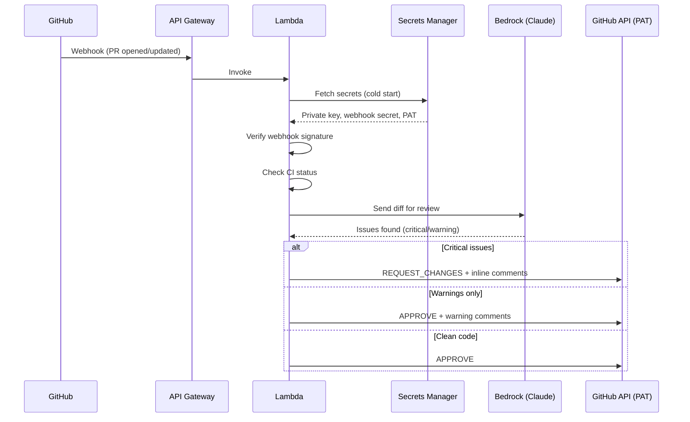
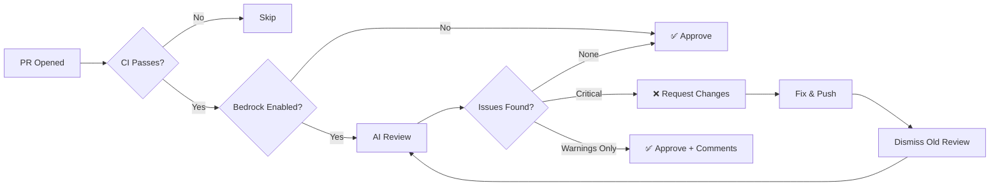

# pr-auto-approver

GitHub App that auto-approves pull requests with AI code review powered by Amazon Bedrock (Claude 3.5 Haiku).

## Architecture



## How It Works



## Features

| Feature | Description |
|---------|-------------|
| AI Code Review | Claude 3.5 Haiku reviews diffs for security issues |
| Severity Levels | Critical blocks, warnings approve with comments |
| Language Support | Python, Node.js, Go, Terraform, Java, and more |
| PAT Approvals | Satisfies branch protection on GitHub Free plan |
| Smart Model Selection | Haiku for small diffs, Sonnet for large ones |
| Project Context | `REVIEW_CONTEXT` env var for smarter reviews |
| Token Health | Warns 14 days before PAT expiry |
| Review Dismissal | Dismisses stale reviews on new pushes |

## Build

```bash
npm ci
npm run zip    # TypeScript → esbuild → lambda.zip (~1MB)
```

## Deploy

Use the [terraform-aws-pr-auto-approver](https://github.com/jonmatum/terraform-aws-pr-auto-approver) module ([Terraform Registry](https://registry.terraform.io/modules/jonmatum/pr-auto-approver/aws)).

## Approval Modes

| Mode | Config | Branch Protection |
|------|--------|-------------------|
| **App token** | default | Doesn't count on Free plan |
| **PAT token** | set `APPROVAL_TOKEN` | ✅ Counts as real user review |

## Files

| File | Purpose |
|------|---------|
| `src/index.ts` | Bot logic — events, CI checks, severity routing |
| `src/lambda.ts` | Lambda handler — secrets on cold start |
| `src/review.ts` | Bedrock — prompt, model selection, parsing |
| `src/secrets.ts` | Secrets Manager client with caching |
| `src/token-health.ts` | PAT expiry monitoring |

## Environment Variables

| Variable | Description | Required |
|----------|-------------|----------|
| `APP_ID` | GitHub App ID | yes |
| `PRIVATE_KEY_SECRET_ARN` | Secrets Manager ARN for private key | yes |
| `WEBHOOK_SECRET_SECRET_ARN` | Secrets Manager ARN for webhook secret | yes |
| `ALLOWED_AUTHORS` | Comma-separated usernames | no |
| `BEDROCK_ENABLED` | `true` to enable AI review | no |
| `BEDROCK_MODEL_ID` | Default model (Claude 3.5 Haiku) | no |
| `BEDROCK_MODEL_ID_LARGE` | Model for large diffs | no |
| `APPROVAL_TOKEN_SECRET_ARN` | Secrets Manager ARN for PAT | no |
| `REVIEW_CONTEXT` | Project description for smarter reviews | no |

## License

MIT
